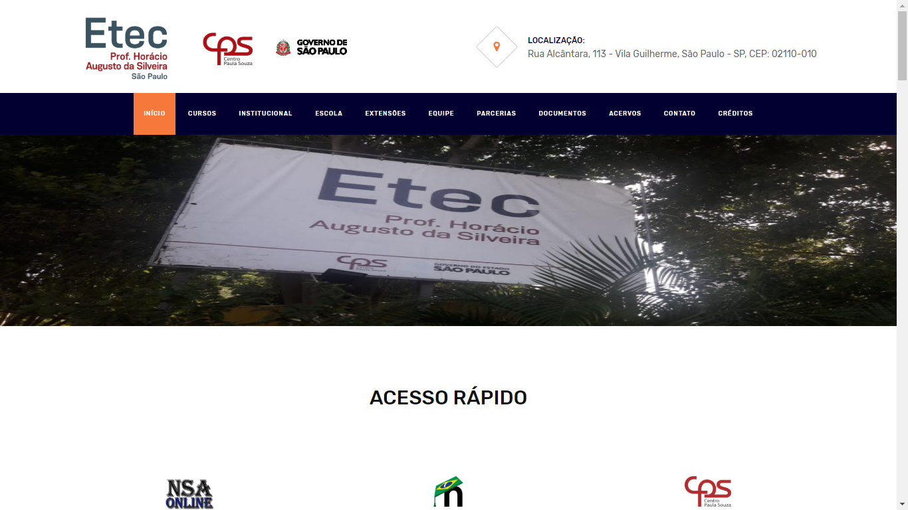

# Etec Horácio Augusto da Silveira
## Protótipo do site da Etec Horácio Augusto da Silveira

O site da Etec Horácio nos próximos anos será o mais importante meio de comunicação das comunidades: Estudantil, Docente e entorno de suas Unidades Educacionais.

## Desenvolvedores

#### Ralf Dewrich Ferreira:

* **Twitter:** [@ralfzeira](https://twitter.com/ralfzeira)
* **Discord:** ralf#6175
* **Email:** ralfferreira995@gmail.com

#### Guilherme José de Lira Brito:

* **Twitter:** [@guilyyra](https://twitter.com/guilyyra) 
* **Discord:** Guilyyra#9404
* **Email:** guilherme.2010.guilherme@gmail.com
